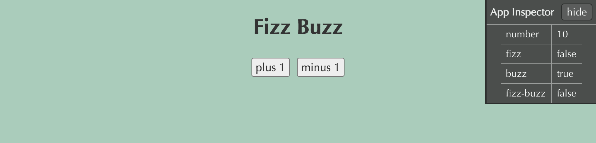

## Overview

A simple overlay panel that gives a live view into the application state. The goal is to make it easier to find the problematic logic when your app isn't behaving as you expected.

It may also be useful when building components, as it can provide lower friction visibility into the state of intermediate variables.

App State Inspector was designed to work with [mithril.js](http://mithril.js.org/) apps out of the box. It should be pretty easy to make it work well with other frameworks, but this hasn't happened yet.

## Usage

#### Install

    > npm install app-state-inspector --save-dev

Include the file `app-state-inspector.css` when developing.

#### Configure

```javascript
// init.js
import m from 'mithril';
import App from 'app';

m.mount(document.body, App);

import Inspector from 'app-state-inspector'
Inspector.mount();
```

#### Usage

```javascript
// app.js
import m from 'mithril';
import Inspector from 'app-state-inspector'

export default {
  controller: function() {
    this.num = 1;
    var self = this;
    this.increment = function() { this.num++; }
    this.decrement = function() { this.num--; }
  },
  view: function(ctrl) {
    Inspector.set('number', ctrl.num);
    Inspector.set('fizz',      ctrl.num % 3 === 0);
    Inspector.set('buzz',      ctrl.num % 5 === 0);
    Inspector.set('fizz-buzz', ctrl.num % 15 === 0);

    return m('div', [
      m('h1', 'Fizz Buzz'),
      m('.button-row', [
        m('button', { onclick: ctrl.increment }, 'plus 1'),
        m('button', { onclick: ctrl.decrement }, 'minus 1')
      ])
    ]);
  }
};
```

## Documentation

### Inspector.set(key, value)

Add (or replace) a row in the overlay panel. `key` must be a unique string. This method will overwrite any previous value stored at the same `key`.

### Inspector.delete(key)

Remove a row from the overlay panel.

### Inspector.clear()

Clear all rows.

### Inspector.mount([opts])

Mount the overlay panel onto the DOM. This should be called only once, when the application loads.

*__opts__* (not required)

```javascript
{
  // Specifies the placement of the overlay panel in the viewport.
  // These are mutually exclusive. The panel can only be in one corner at a time.
  // default -> topRight: true
  topLeft:      Boolean
  topRight:     Boolean
  bottomLeft:   Boolean
  bottomRight:  Boolean

  // Sets the overlay panel to be collapsed on page load.
  // default -> false
  isCollapsed:  Boolean
}
```

## Run the demo

    > cd node_modules/app-state-inspector
    > npm install
    > npm run build:demo

Then you can open _demo/index.html_ in your browser. You should see something similar to the screenshot below


